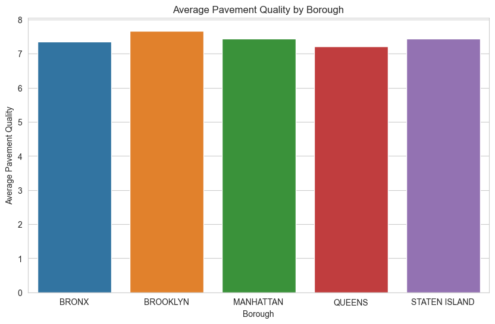
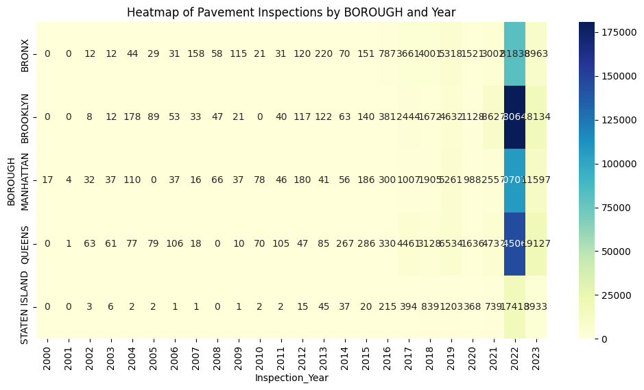
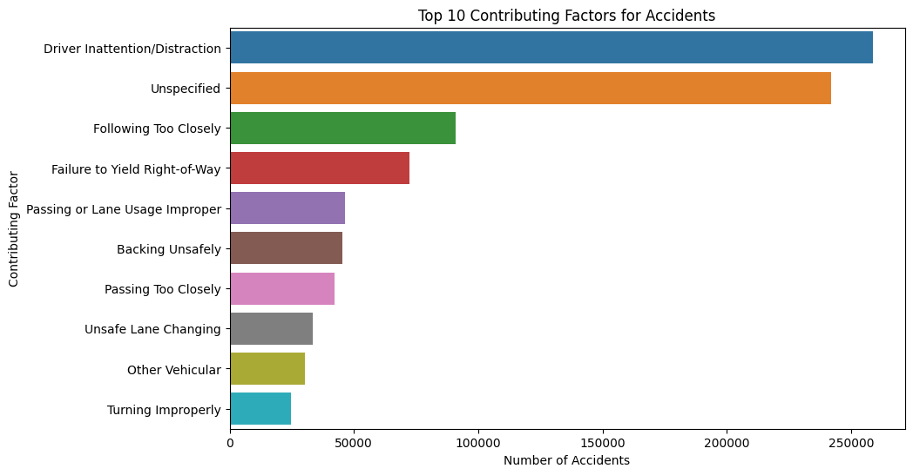
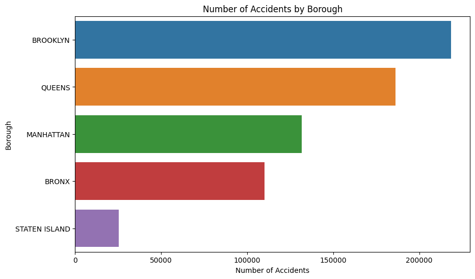
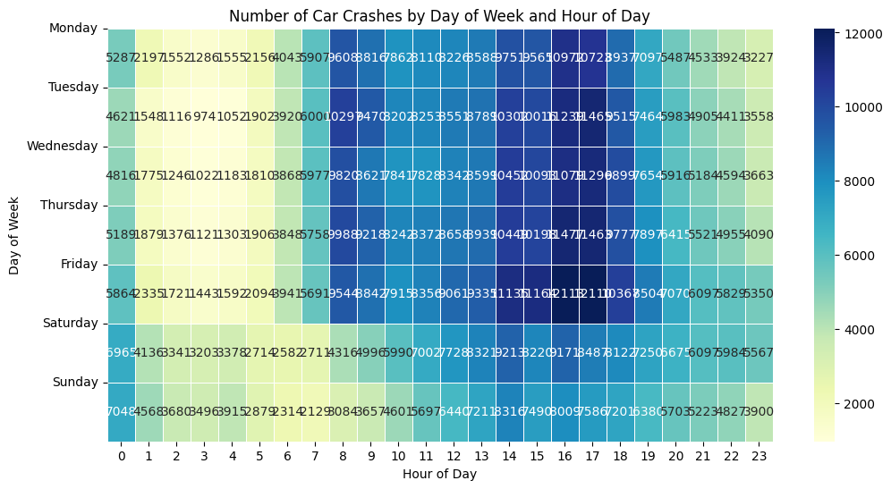

# Project Title: Analysis of Car Crash Data and Pavement Ratings in New York City

# Subject: IA-626
## Description
This project analyzes car crash data and pavement ratings in New York City to identify patterns and potential areas for improvement in road safety. The project involves merging two datasets - car crash data and pavement ratings data - based on the latitude and longitude of the crashes and the street segments in the pavement ratings data. The merged dataset is then used to conduct various analyses, including visualizing the distribution of crashes over time, identifying the most dangerous street segments, and examining the relationship between pavement ratings and crash frequency. The project utilizes various tools and techniques such as data cleaning, data merging, data visualization, and statistical analysis.

## Technologies Used
- Python
- Pandas
- NumPy
- Matplotlib
- Folium

## Data Sources
- Car Crash Data: NYC Open Data
- Pavement Ratings Data: NYC Open Data

## Project Deliverables
- Python code for data cleaning, merging, and analysis
- Visualizations and graphs to show insights and patterns
- Final report summarizing findings and recommendations for improving road safety in New York City.

## Columns with discription of Crash Data:

| Column Name                   | Description                                             |
|-------------------------------|---------------------------------------------------------|
| CRASH DATE                    | Date of the crash                                       |
| CRASH TIME                    | Time of the crash                                       |
| BOROUGH                       | Borough where the crash occurred                        |
| ZIP CODE                      | Zip code where the crash occurred                       |
| LATITUDE                      | Latitude of the crash location                          |
| LONGITUDE                     | Longitude of the crash location                         |
| LOCATION                      | Coordinates of the crash location (latitude, longitude) |
| ON STREET NAME                | Name of the street where the crash occurred             |
| CROSS STREET NAME             | Name of the nearest cross street to the crash location  |
| OFF STREET NAME               | Name of the nearest off-street to the crash location    |
| NUMBER OF PERSONS INJURED     | Total number of persons injured in the crash            |
| NUMBER OF PERSONS KILLED      | Total number of persons killed in the crash             |
| NUMBER OF PEDESTRIANS INJURED | Number of pedestrians injured in the crash              |
| NUMBER OF PEDESTRIANS KILLED  | Number of pedestrians killed in the crash               |
| NUMBER OF CYCLIST INJURED     | Number of cyclists injured in the crash                 |
| NUMBER OF CYCLIST KILLED      | Number of cyclists killed in the crash                  |
| NUMBER OF MOTORIST INJURED    | Number of motorists injured in the crash                |
| NUMBER OF MOTORIST KILLED     | Number of motorists killed in the crash                 |
| CONTRIBUTING FACTOR VEHICLE 1 | Contributing factor for vehicle 1 involved in the crash |
| CONTRIBUTING FACTOR VEHICLE 2 | Contributing factor for vehicle 2 involved in the crash |
| CONTRIBUTING FACTOR VEHICLE 3 | Contributing factor for vehicle 3 involved in the crash |
| CONTRIBUTING FACTOR VEHICLE 4 | Contributing factor for vehicle 4 involved in the crash |
| CONTRIBUTING FACTOR VEHICLE 5 | Contributing factor for vehicle 5 involved in the crash |
| COLLISION_ID                  | Unique identifier for the collision                     |
| VEHICLE TYPE CODE 1           | Type of vehicle 1 involved in the crash                 |
| VEHICLE TYPE CODE 2           | Type of vehicle 2 involved in the crash                 |
| VEHICLE TYPE CODE 3           | Type of vehicle 3 involved in the crash                 |
| VEHICLE TYPE CODE 4           | Type of vehicle 4 involved in the crash                 |
| VEHICLE TYPE CODE 5           | Type of vehicle 5 involved in the crash                 |

## Columns with discription of Pavement Data:

| Column Name   | Description                                                         |
|---------------|---------------------------------------------------------------------|
| the_geom      | Geometry of the street segment                                      |
| SegmentID     | Unique identifier for the street segment                            |
| BoroughCod    | Borough code for the street segment                                 |
| OFTCode       | Office of Freight Transportation (OFT) code for the segment         |
| OnStreetNa    | Name of the street                                                  |
| FromStreet    | Name of the street at the starting point of the segment             |
| ToStreetNa    | Name of the street at the ending point of the segment               |
| WKT           | Well-Known Text (WKT) representation of the street segment geometry |
| ManualRati    | Manual rating of the street pavement                                |
| RatingLaye    | Rating layer for the street pavement                                |
| Inspection    | Inspection                                                          |
| Shape_STLe    | Shape street length                                                 |


## Cleaning Car Crash and Pavement Data

This script reads the car crash and pavement data, drops unnecessary columns, handles missing values, and extracts coordinates for pavement data. The cleaned datasets are then saved as new CSV files.

The script performs the following steps:

```python
import pandas as pd
import numpy as np


# Drop unnecessary columns
car_crash_data = car_crash_data.drop(columns=['LOCATION','CONTRIBUTING FACTOR VEHICLE 2','CONTRIBUTING FACTOR VEHICLE 3','CONTRIBUTING FACTOR VEHICLE 4','CONTRIBUTING FACTOR VEHICLE 5' 'VEHICLE TYPE CODE 2', 'VEHICLE TYPE CODE 3', 'VEHICLE TYPE CODE 4', 'VEHICLE TYPE CODE 5'])
pavement_data = pavement_data.drop(columns=['BoroughCod', 'OFTCode', 'WKT', 'Shape_STLe'])

# Handle missing values
car_crash_data['LATITUDE'].fillna(car_crash_data['LATITUDE'].mean(), inplace=True)
car_crash_data['LONGITUDE'].fillna(car_crash_data['LONGITUDE'].mean(), inplace=True)

def extract_coordinates(coordinate_str):
    coordinates = coordinate_str.strip('MULTILINESTRING (()).').split(' ')[1:]
    lat = float(coordinates[0].strip(','))
    lon = float(coordinates[1])
    return lat, lon

pavement_data['LATITUDE'], pavement_data['LONGITUDE'] = zip(*pavement_data['the_geom'].apply(extract_coordinates))
pavement_data = pavement_data.drop(columns=['the_geom'])

# Save cleaned data to new CSV files
car_crash_data.to_csv('cleaned_car_crash_data.csv', index=False)
pavement_data.to_csv('cleaned_pavement_data.csv', index=False)

```

1. Import necessary libraries (pandas and numpy).
2. Drop unnecessary columns from car crash data and pavement data.
3. Fill missing values in the 'LATITUDE' and 'LONGITUDE' columns of car crash data with the mean of the respective columns.
4. Define a function `extract_coordinates` that takes a coordinate string and extracts the latitude and longitude values.
5. Apply the `extract_coordinates` function to the 'the_geom' column of pavement data to create new 'LATITUDE' and 'LONGITUDE' columns.
6. Drop the 'the_geom' column from pavement data.
7. Save the cleaned car crash data and pavement data to new CSV files called 'cleaned_car_crash_data.csv' and 'cleaned_pavement_data.csv', respectively.
"""


## Merging Car Crash Data with Pavement Data

This script reads cleaned car crash and pavement data, finds the closest pavement to each car crash location, and adds related pavement information to the car crash data. The resulting merged dataset is then saved as a new CSV file.

The script performs the following steps:
```python
import pandas as pd
import numpy as np
from scipy.spatial.distance import cdist

def find_closest_pavement(crash_lat, crash_lon, pavement_data):
    pavement_coords = pavement_data[['LATITUDE', 'LONGITUDE']].values
    crash_coord = np.array([crash_lat, crash_lon])
    distance = cdist(crash_coord.reshape(1, -1), pavement_coords)
    min_index = np.argmin(distance)
    return pavement_data.iloc[min_index]

# Load the cleaned data
car_crash_data = pd.read_csv('cleaned_car_crash_data.csv')
pavement_data = pd.read_csv('cleaned_pavement_data.csv')

car_crash_data_with_pavement = car_crash_data.copy()
car_crash_data_with_pavement[['Pavement_LATITUDE', 'Pavement_LONGITUDE', 'Pavement_SegmentID', 'Pavement_ManualRati', 'Pavement_RatingLaye', 'Pavement_Inspection']] = car_crash_data.apply(
    lambda row: find_closest_pavement(row['LATITUDE'], row['LONGITUDE'], pavement_data)[['LATITUDE', 'LONGITUDE', 'SegmentID', 'ManualRati', 'RatingLaye', 'Inspection']], axis=1)

car_crash_data_with_pavement.to_csv('merged_car_crash_pavement_data.csv', index=False)

```

1. Import necessary libraries (pandas, numpy, and scipy.spatial.distance).
2. Define a function `find_closest_pavement` that takes the latitude and longitude of a car crash and the pavement data, then calculates the distance between the car crash location and each pavement location to find the closest pavement.
3. Load the cleaned car crash data and pavement data from their respective CSV files.
4. Create a copy of the car crash data and add new columns for the pavement information (latitude, longitude, segment ID, manual rating, rating layer, and inspection).
5. For each row in the car crash data, apply the `find_closest_pavement` function to find the closest pavement and fill in the corresponding pavement information columns.
6. Save the merged car crash and pavement data to a new CSV file called `merged_car_crash_pavement_data.csv`.
"""

| Dataset | Rows Before Merging | Rows After Merging | Columns |
|---------|--------------------|--------------------|---------|
| Car Crashes | 1048575 | - | 29 |
| Pavement Quality | 133553 | - | 12 |
| Merged Data | - | 1048575 | 26 |

| Column Name                  | Value 1                       | Value 2                       | Value 3                       |
|------------------------------|-------------------------------|-------------------------------|-------------------------------|
| CRASH DATE                   | 02/24/2019                    | 02/15/2018                    | 11-11-2021                    |
| CRASH TIME                   | 16:35                         | 19:00                         | 06:40                         |
| BOROUGH                      | BRONX                         | BRONX                         | STATEN ISLAND                 |
| ZIP CODE                     | 10465.0                       | 10453.0                       | 10301.0                       |
| LATITUDE                     | 40.829205                     | 40.85396                      | 40.613476                     |
| LONGITUDE                    | -73.82487                     | -73.90944                     | -74.09793                     |
| ON STREET NAME               |                               | GRAND AVENUE                 | HOWARD AVENUE                 |
| CROSS STREET NAME            |                               | WEST BURNSIDE AVENUE         | MARTHA STREET                 |
| OFF STREET NAME              | 3594 EAST TREMONT AVENUE     |                               |                               |
| NUMBER OF PERSONS INJURED    |                               |                               |                               |
| NUMBER OF PERSONS KILLED     |                               |                               |                               |
| NUMBER OF PEDESTRIANS INJURED|                               |                               |                               |
| NUMBER OF PEDESTRIANS KILLED |                               |                               |                               |
| NUMBER OF CYCLIST INJURED    |                               |                               |                               |
| NUMBER OF CYCLIST KILLED     |                               |                               |                               |
| NUMBER OF MOTORIST INJURED   |                               |                               |                               |
| NUMBER OF MOTORIST KILLED    |                               |                               |                               |
| CONTRIBUTING FACTOR VEHICLE 1| Steering Failure              | Unspecified                   | Unsafe Speed                  |
| VEHICLE TYPE CODE 1          | Sedan                         | Station Wagon/Sport Utility Vehicle | Sedan                      |
| COLLISION_ID                 | 4086892                       | 3847523                       | 4477036                       |
| Pavement_LATITUDE            | 40.82922373                   | 40.85395944                   | 40.6134788                    |
| Pavement_LONGITUDE           | -73.8252946                   | -73.90958046                  | -74.09811016                  |
| Pavement_SegmentID           | 94,504                        | 73,059                        | 13,242                        |
| Pavement_ManualRati          | 8                             | 8                             | 8                             |
| Pavement_RatingLaye          | GOOD                          | GOOD                          | GOOD                          |
| Pavement_Inspection          | 07/23/2022 12:00:00 AM        | 12/20/2022 12:00:00 AM        | 12/17/2022 12:00:00 AM        |


## Update Missing ZIP Codes in Merged Dataset

This script populates the missing ZIP codes in the 'merged_car_crash_pavement_data.csv' file using latitude and longitude, and then saves the updated data back to the same file. It uses the geopy library for reverse geocoding.

```python
import pandas as pd
from geopy.geocoders import Nominatim
from geopy.exc import GeocoderTimedOut

geolocator = Nominatim(user_agent="geoapiExercises")

def get_zipcode(lat, long):
    try:
        location = geolocator.reverse(f"{lat}, {long}")
        return location.raw['address'].get('postcode')
    except GeocoderTimedOut:
        return get_zipcode(lat, long)
    except Exception as e:
        print(e)
        return None

# Load the merged dataset
with open('merged_car_crash_pavement_data.csv', encoding='utf-8', errors='replace') as file:
    merged_data = pd.read_csv(file)

# Fill missing ZIP codes using latitude and longitude
merged_data['ZIP CODE'] = merged_data.apply(lambda row: get_zipcode(row['LATITUDE'], row['LONGITUDE']) if pd.isnull(row['ZIP CODE']) else row['ZIP CODE'], axis=1)

# Save the updated dataset to the same file
merged_data.to_csv('merged_car_crash_pavement_data.csv', index=False)
```

## Based on the provided correlation matrix, here are some key observations:


1. There is a strong negative correlation between LATITUDE and LONGITUDE (-0.957), which is expected because latitude and longitude values are related in describing a location.

2. The NUMBER OF PERSONS INJURED has a strong positive correlation with NUMBER OF MOTORIST INJURED (0.908). This indicates that a significant number of people injured in car crashes are motorists.

3. NUMBER OF PERSONS KILLED has a strong positive correlation with NUMBER OF MOTORIST KILLED (0.659) and NUMBER OF PEDESTRIANS KILLED (0.689). This shows that both pedestrians and motorists contribute significantly to the number of fatalities in car crashes.

4. There is a weak positive correlation between Pavement_ManualRati and Pavement_LONGITUDE (0.09) and a weak negative correlation between Pavement_ManualRati and Pavement_LATITUDE (-0.204). This suggests that pavement ratings could be slightly influenced by geographical location, although the relationship is not very strong.

5. Other correlations between the number of injuries or fatalities and pavement characteristics are weak, which implies that the pavement rating or inspection may not have a strong impact on the number of injuries and fatalities in car crashes.

## Number of Accidents by Pavement Rating

The dataset contains information about car crashes and their corresponding pavement ratings. The pavement ratings are categorized into three levels: GOOD, FAIR, and POOR. The analysis aims to understand the relationship between pavement conditions and the number of accidents.


Based on the data, we can observe the following:

- **GOOD Pavement Rating:** 622,865 accidents
- **FAIR Pavement Rating:** 419,195 accidents
- **POOR Pavement Rating:** 6,515 accidents

The vast majority of accidents occurred on roads with GOOD and FAIR pavement ratings. Accidents on POOR-rated pavements were significantly less frequent. This could be due to several factors, such as lower traffic volumes on poorly maintained roads or other confounding variables. Further analysis is needed to understand the underlying reasons for this distribution.

## Pavement Quality by Borough



1. **Bronx**: The average pavement quality in the Bronx is 7.35, which indicates moderately good pavement conditions.
2. **Brooklyn**: Brooklyn has an average pavement quality of 7.67, which suggests that the pavement conditions are relatively good compared to other boroughs.
3. **Manhattan**: With an average pavement quality of 7.43, Manhattan has moderately good pavement conditions.
4. **Queens**: Queens has the lowest average pavement quality among the boroughs, with a score of 7.22, indicating that the pavement conditions are relatively worse compared to other boroughs.
5. **Staten Island**: Staten Island has an average pavement quality of 7.44, which shows that the pavement conditions are moderately good.

This analysis demonstrates the differences in pavement quality across the boroughs in New York City, with Brooklyn having the highest average pavement quality and Queens having the lowest.

## Pavement Inspections Heatmap by BOROUGH and Year

This heatmap displays the number of pavement inspections conducted in each borough of New York City from 2000 to 2023. The data is color-coded, with darker colors representing higher counts of inspections. 

The heatmap shows that the number of inspections has generally increased over the years, with a significant increase in the 2010s and early 2020s. In particular, Brooklyn has seen the highest number of inspections, followed by Queens, Manhattan, the Bronx, and Staten Island.




## Top 10 Contributing Factors for Accidents

The dataset contains information about car crashes and their contributing factors. The analysis aims to identify the most common factors contributing to accidents.



Based on the data, the top 10 contributing factors for accidents are:

1. **Driver Inattention/Distraction:** 258,545 accidents
2. **Unspecified:** 241,845 accidents
3. **Following Too Closely:** 91,000 accidents
4. **Failure to Yield Right-of-Way:** 72,180 accidents
5. **Passing or Lane Usage Improper:** 46,499 accidents
6. **Backing Unsafely:** 45,505 accidents
7. **Passing Too Closely:** 42,256 accidents
8. **Unsafe Lane Changing:** 33,486 accidents
9. **Other Vehicular:** 30,205 accidents
10. **Turning Improperly:** 24,665 accidents

The most common contributing factor is driver inattention/distraction, followed by unspecified factors. This analysis highlights the importance of addressing driver behavior and education to reduce the number of accidents on the road.

## Number of Accidents by Borough

The dataset contains information about car crashes in different boroughs. The analysis aims to understand the distribution of accidents across boroughs.



Based on the data, the number of accidents by borough is:

- **Brooklyn:** 218,584 accidents
- **Queens:** 186,285 accidents
- **Manhattan:** 131,633 accidents
- **Bronx:** 110,163 accidents
- **Staten Island:** 25,246 accidents

Brooklyn has the highest number of accidents, followed by Queens and Manhattan. Staten Island has the lowest number of accidents among the boroughs. This information can help guide traffic safety initiatives and resource allocation to reduce accidents in each borough.

## Top 10 Vehicle Types Involved in Accidents

The dataset contains information about car crashes and the types of vehicles involved. The analysis aims to identify the most common vehicle types involved in accidents.


Based on the data, the top 10 vehicle types involved in accidents are:

1. **Sedan:** 493,178 accidents
2. **Station Wagon/Sport Utility Vehicle:** 369,496 accidents
3. **Taxi:** 43,820 accidents
4. **Pick-up Truck:** 28,830 accidents
5. **Box Truck:** 19,918 accidents
6. **Bus:** 16,871 accidents
7. **Bike:** 11,261 accidents
8. **Tractor Truck Diesel:** 8,360 accidents
9. **Van:** 6,980 accidents
10. **Motorcycle:** 6,116 accidents

Sedans and station wagons/sport utility vehicles are the most common vehicle types involved in accidents. Understanding the distribution of vehicle types can help inform targeted safety initiatives and regulations for specific vehicle classes.


## Total Number of Car Crashes by Year

The following table shows the total number of car crashes per year:

| Year | Number of Accidents |
|------|---------------------|
| 2012 | 4                   |
| 2013 | 0                   |
| 2014 | 0                   |
| 2015 | 0                   |
| 2016 | 81,672              |
| 2017 | 231,007             |
| 2018 | 231,563             |
| 2019 | 211,486             |
| 2020 | 112,909             |
| 2021 | 110,532             |
| 2022 | 69,402              |

The line chart below illustrates the total number of car crashes per year. The x-axis represents the years, while the y-axis indicates the number of car crashes. The chart shows that the number of accidents increased significantly from 2016 to 2018, after which it started to decrease. The year 2022 has the lowest number of accidents in the dataset.


## Car Crash Analysis by Day of Week and Hour of Day

The data shows the number of car crashes that occurred throughout the week, broken down by the hour of the day. This analysis can help us identify patterns and trends in car accidents and potentially inform traffic management strategies or accident prevention measures.


- Weekdays (Monday through Friday) consistently show a higher number of accidents during morning and evening rush hours (approximately 7-9 AM and 4-6 PM). This is likely due to increased traffic volumes during these times.

- On weekends (Saturday and Sunday), the pattern is different. The number of accidents is generally lower in the early morning hours but increases steadily throughout the day, peaking in the early afternoon (around 2-3 PM). This could be attributed to increased recreational activities and travel during weekends.

- The overall lowest number of accidents occurs in the early morning hours, typically between 3-5 AM, when traffic volumes are lowest.

- Fridays and Saturdays have the highest number of accidents late at night (from 10 PM to 2 AM), possibly related to social and nightlife activities.

- Tuesday has the highest number of accidents during peak weekday hours (8-9 AM and 4-6 PM), which may suggest a greater need for traffic management interventions on this particular day.

In conclusion, the data reveals that car crashes follow different patterns depending on the day of the week and time of day. Focusing on these high-risk periods and implementing appropriate traffic management or accident prevention strategies can help reduce the number of car crashes and improve overall road safety.


## Conclusion

In conclusion, this analysis provides valuable insights into the trends and patterns of car crashes in New York City. The data suggests that certain factors, such as pavement quality, vehicle type, and day of the week and time of day, can have a significant impact on the occurrence of car accidents.

Future work could involve deeper analysis of the relationships between these factors and car crashes, as well as exploring other potential contributing factors, such as weather conditions, road design, and driver demographics. This analysis can also serve as a basis for developing targeted traffic safety initiatives and policies to reduce the number of car crashes in New York City.

Overall, this project demonstrates the power of data analysis and the potential impact it can have on improving public safety and well-being.
